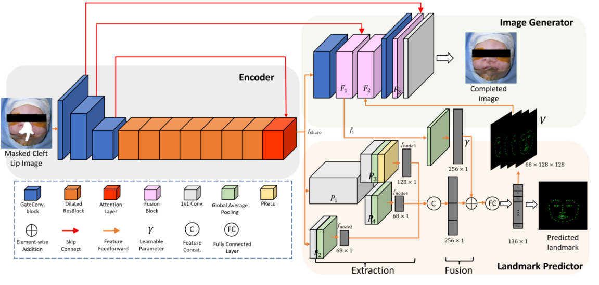

# A Feasibility Study on Image Inpainting for Non-cleft Lip Generation from Cleft Lip Patients
A Cleft lip is a congenital abnormality requiring surgical repair by a specialist.The surgeon must have extensive experience and theoretical knowledge to perform surgery, and Artificial Intelligence (AI) method has been proposed to guide surgeons in improving surgical outcomes. If AI can be used to predict what a repaired cleft lip would look like, surgeons could use it as an adjunct to adjust their surgical technique and improve results. To explore the feasibility of this idea while protecting patient privacy, we propose a deep learning-based image inpainting method that is capable of covering a cleft lip and generating a lip and nose without a celft. Our experiments are conducted on two real-world cleft lip datasets and are assessed by expert cleft lip surgeons to demonstrate the feasibility of the proposed method. [arXiv](https://arxiv.org/abs/2208.01149)
--------------------
**Overview**


**Dataset**
--------------------
For the full CelebA dataset, please refer to http://mmlab.ie.cuhk.edu.hk/projects/CelebA.html

For the irrgular mask dataset, please refer to http://masc.cs.gmu.edu/wiki/partialconv

For the landmarks, please use https://github.com/1adrianb/face-alignment to generate landamrks as ground truth.

Please use `script/flist.py` to create `.flist` file for training and testing.

**Pre-trained model**
--------------------
We released the pre-trained model 
CelebA: [Google Drive](https://drive.google.com/drive/folders/1H9FZ-jJUkYBDcNASX8kBnmipgGgv_y7t?usp=sharing)

**Getting Started**
----------------------
Download the pre-trained model to `./checkpoints`

Set your own `config.yml` file and copy it to corresponding checkpoint folder, run:
```
python train.py
```
For testing, run:
```
python test.py
```
